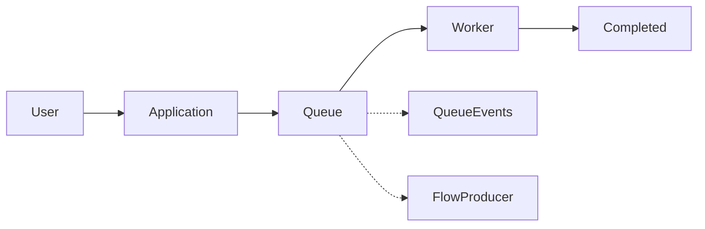

<div align="center">

# 🐂 BullMQ in Simple Words

### A Simple Way to Handle Background Jobs in Node.js

> **BullMQ** helps applications process long-running tasks in the background without blocking the main application.


</div>

---

# 📚 Table of Contents

- What is BullMQ?
- Queue
- Worker
- QueueEvents
- FlowProducer
- Real-Life Example
- Complete Flow
- In Simple Words
- Key Takeaway

---

# 1️⃣ What is BullMQ?

BullMQ is a **Node.js library** used for processing **background jobs**.

Instead of making users wait while heavy tasks finish, BullMQ moves those tasks into a queue where they are processed separately.

### Common Use Cases

- 📧 Sending Emails
- 📄 Generating Reports
- 🖼 Processing Images
- 🎥 Video Conversion
- 📱 Sending Notifications

### Why BullMQ?

- ✅ Reliable
- ⚡ Fast
- 📈 Scalable
- 😊 Easy to Use

> BullMQ is built on **Redis** and consists of four main classes working together.

---

# 2️⃣ Queue

A **Queue** is simply a waiting line where jobs are stored until a worker processes them.

```text
Application
      │
      ▼
 Add Job
      │
      ▼
  Queue
      │
 Waiting...
```

### Queue Operations

- ➕ Add Jobs
- ⏸ Pause Queue
- 🧹 Clean Queue
- 📊 Get Queue Information

### Example

```javascript
queue.add("send-email", {
    email: "john@example.com"
});
```

---

# 3️⃣ Worker

A **Worker** continuously listens to the queue.

Whenever a new job arrives, the worker picks it and processes it.

```text
Queue
   │
   ▼
Worker
   │
   ▼
Processing
   │
   ├── ✅ Completed
   └── ❌ Failed
```

### Good to Know

- Multiple workers can process jobs simultaneously.
- Workers may run on:
  - Same Process
  - Different Processes
  - Different Servers

---

# 4️⃣ QueueEvents

QueueEvents listen to everything happening inside the queue.

It tells us when a job changes its status.

### Events

| Event | Description |
|--------|-------------|
| ✅ completed | Job finished successfully |
| ❌ failed | Job execution failed |
| ▶ active | Job started |
| ⏳ waiting | Waiting inside queue |
| 🗑 removed | Job removed |

### Example

```javascript
queueEvents.on("completed", ({ jobId }) => {
    console.log(`Job ${jobId} completed`);
});
```

---

# 5️⃣ FlowProducer

Sometimes one job depends on another.

FlowProducer helps create **parent-child relationships** between jobs.

Example

```text
Upload Video
      │
      ▼
Generate Thumbnail
      │
      ▼
Convert Video
      │
      ▼
Send Notification
```

Child jobs run **only after** the parent job completes.

---

# 6️⃣ Real-Life Example

Imagine an online shopping website.

```text
🛒 Order Placed
        │
        ▼
💳 Check Payment
        │
        ▼
📦 Pack Item
        │
        ▼
🚚 Ship Item
        │
        ▼
📩 Send SMS / Email
```

### Behind the Scenes

- Order is placed
- Job is added to Queue
- Worker processes the job
- QueueEvents notify updates
- FlowProducer manages dependencies

---

# 7️⃣ Complete Flow



All four BullMQ components work together to process background jobs smoothly.

---

# 8️⃣ In Simple Words

| Component | Simple Meaning |
|------------|----------------|
| 📦 Queue | Waiting line where jobs stay |
| 👷 Worker | Program that performs the work |
| 🔔 QueueEvents | Notification system |
| 🔗 FlowProducer | Handles job dependencies |

Together they make background job processing **simple, reliable and scalable**.

---

# 💡 Remember

> 📦 Queue keeps the jobs.

> 👷 Worker processes the jobs.

> 🔔 QueueEvents tell what happened.

> 🔗 FlowProducer makes sure dependent jobs run in the correct order.

---

<div align="center">

# 🎯 Key Takeaway

BullMQ itself **does not perform your business logic**.

It provides the infrastructure to:

📦 Store Jobs

⚙ Process Jobs

🔔 Track Events

🔗 Manage Dependencies

so your application stays **fast**, **responsive**, and **scalable**.

---

### 📚 Tech Learnings

**Learning in Public • One Concept at a Time**

*Today's Topic:* **BullMQ**

⭐ If you found this helpful, consider giving the repository a **Star**.

---

Made with ❤️ by **Khushbu Agarwal**

</div>
